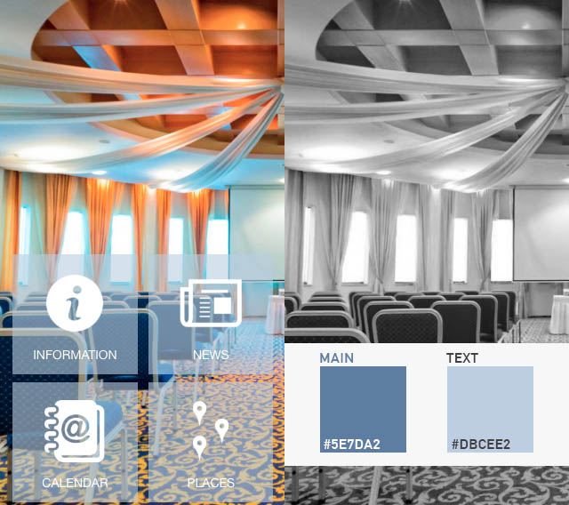

# Template

[Edit this on Github](https://github.com/Xtraball/SiberianCMS-Doc/edit/master/docs/customization/template.md)

** *Note: Template packages require Siberian 4.15.0 and above, otherwise they will not work* **

Demo template can be found [here](../img/template/template-corporate.zip)! 

### What you need

* A nice template idea !

**And to define its name:**

* Your template name, like `TemplateAwesome`. note: always prefix it with `Template` this will avoid collision with modules!

## Structure of a template package

Templates are installed in the `app/local/modules` folder

&nbsp;

Below is the complete and minimal required structure for a template pack

```raw
TemplateAwesome.zip
├─ resources
│  ├─ db
│  │  └─ data
│  │     └─ template-awesome.php
│  └─ images
│     └─ templates
│        └─ awesome
│           └─ unified
│              ├─ background.jpg // Must be square and 2732x2732px
│              ├─ icon.jpg // Must be square and 512x512px
│              └─ overview_new.jpg // Must be 640x568px
└─ package.json
```

#### overview_new.jpg

Example



### package.json

The `package.json` is used by the Installer to know the requirements, and routines to run during the installation/update process of your Template pack

```json
{
    "name": "TemplateAwesome",
    "version": "1.0.0",
    "description": "Awesome template installer.",
    "dependencies": {
        "system": {
            "type": "SAE",
            "version": "4.15.0" /** 4.15.0 is required for the Template to work! */
        }
    },
    "type": "template" /** The type is important for Siberian to identify it as a template! */
}
```

|Field|Required&nbsp;?|Description|
|-----|---------------|-----------|
|name|yes|Package name, avoid spaces and numbers|
|description|yes|Package description|
|type|yes|must be `template`|
|version|yes|Your template pack version, for updates|
|dependencies|yes|**version*:** 4.15.0 minimum, **type:** SAE/MAE/PE minimum installation type required|

** * version must be at least 4.15.0**

### Data

`template-awesome.php`

This file creates & updates the entry in database and copy assets at installation time

If you need to change options in your module while providing an update you must change the values here

```php
<?php

// Ionic colors check the Colors page for the extensive list!
$ionicColors = [
    'header' => [
        'color' => '#5e7da2',
        'background_color' => '#f8f8f8'
    ],
    'background' => [
        'background_color' => '#bdcee2'
    ],
    'homepage' => [
        'color' => '#ffffff',
        'background_color' => '#bdcee2',
        'background_opacity' => '60',
        'border_color' => '#ffffff',
        'image_color' => '#ffffff'
    ],
    'list_item_divider' => [
        'color' => '#5e7da2',
        'background_color' => '#f8f8f8'
    ],
    'list_item' => [
        'color' => '#404040',
        'background_color' => '#e8e6f7'
    ],
    'card_item_divider' => [
        'color' => '#ffffff',
        'background_color' => '#5e7da2'
    ],
    'card_item' => [
        'color' => '#444',
        'background_color' => '#e4ecf5'
    ],
    'buttons' => [
        'color' => '#ffffff',
        'background_color' => '#5e7da2',
        'border_color' => '#e0e0e0'
    ],
    'checkbox_on' => [
        'color' => '#5e7da2',
        'background_color' => '#bdcee2'
    ],
    'checkbox_off' => [
        'background_color' => '#5e7da2'
    ],
    'checkbox_general' => [
        'color' => '#5e7da2',
        'background_color' => '#ffffff'
    ],
    'radio' => [
        'color' => '#5e7da2',
        'background_color' => '#ffffff'
    ],
    'toggle_on' => [
        'background_color' => '#5e7da2'
    ],
    'toggle_general' => [
        'color' => '#404040',
        'background_color' => '#ffffff'
    ],
    'toggle_off' => [
        'background_color' => '#ffffff',
        'border_color' => '#bdcee2'
    ],
    'toggle_handle_on' => [
        'background_color' => '#bdcee2'
    ],
    'toggle_handle_off' => [
        'background_color' => '#ffffff'
    ],
    'tooltip' => [
        'color' => '#ffffff',
        'background_color' => '#5e7da2'
    ],
    'spinner_ios_text' => [
        'background_color' => '#5e7da2'
    ],
    'spinner_android_text' => [
        'background_color' => '#5e7da2'
    ]
];

// These are the default features you want to be created with the Template
$features = [
    'custom_page' => [
        'name' => 'Information'
    ],
    'newswall' => [
        'name' => 'News'
    ],
    'calendar' => [
        'name' => 'Events'
    ],
    'places' => [
        'name' => 'Restaurants'
    ],
];

\Siberian\Template::installOrUpdate(
    'TemplateAwesome',
    'Awesome',
    'awesome', // A unique code to identify your template (once set, never change it, or this will create a new Template)
    'layout_5', // A layout to use in conjuction with your Template
    ['Food'], // The category the templates belongs too
    $ionicColors,
    $features
);
```
