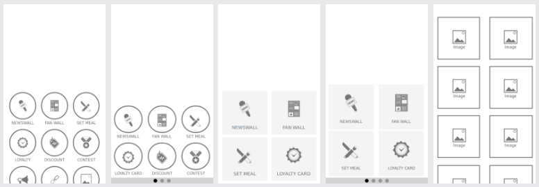

# Layout

** *Note: layout packages must require Siberian 4.5.0 minimum otherwise they will not work* **

Here you'll find everything needed to start developing your first layout, from structure to update routine & packaging.

## What is a layout ?

Layouts are the entry point of your Siberian Applications, they define your application homepage design.

Here you can find a module skeleton to start with [Siberian layout Skeleton, Job](https://github.com/Xtraball/siberian-layout-skeleton)

Layouts are installed in the `app/local/modules` folder, for more information about the inheritance see this page [module/core-inheritance](module/core-inheritance)



### What you need

* A new idea for a cool UI to share !
* Knowledge about html/css/javascript
* Follow these instructions

## Structure of a layout package

Here is the complete and minimal required structure for a layout as in the layout skeleton

```raw
LayoutName.zip
├─ resources
│  ├─ db
│  │  └─ data
│  │     └─ layout.php
│  ├─ design
│  │  └─ desktop
│  │     ├─ flat
│  │     │  └─ images
│  │     │     └─ customization
│  │     │        └─ layout
│  │     │           └─ homepage
│  │     │              └─ layout_skeleton.png
│  │     └─ siberian
│  │        └─ images
│  │           └─ customization
│  │              └─ layout
│  │                 └─ homepage
│  │                    └─ layout_skeleton.png
│  └─ var
│     └─ apps
│        └─ modules
│           └─ layout
│              └─ home
│                 └─ layout_skeleton
│                    ├─ hooks.js
│                    ├─ style.css
│                    └─ view.html
├─ bootstrap.php
├─ package.json
└─ [...]
```

### Structure of package.json

The `package.json` is used by the Installer to know the requirements, and routines to run during the installation/update process of your layout

```json
{
  "name": "LayoutName",
  "description": "Layout description",
  "type": "layout",
  "version": "1.0",
  "dependencies": {
    "system": {
      "type": "SAE",
      "version": "4.5.0"
    }
  }
}
```

** * version must be at least 4.5.0**

### Structure of bootstrap.php

We use `bootstrap.php` to hook & register the layout files into Siberian & update assets.

```php
<?php
class LayoutName_Bootstrap {

    public static function init($bootstrap) {
        # Register assets
        Siberian_Assets::registerAssets(
            "LayoutName", 
            "/app/local/modules/LayoutName/resources/var/apps/"
        );
        
        # Hook javascript to index.html
        Siberian_Assets::addJavascripts(array(
            "modules/layout/home/layout_name/hooks.js",
        ));
        
        # Hook stylesheets to index.html
        Siberian_Assets::addStylesheets(array(
            "modules/layout/home/layout_name/style.css",
        ));
    }
}
```
