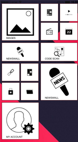
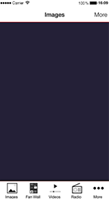
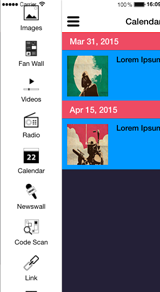

# Layout

[Improve this doc](https://github.com/Xtraball/SiberianCMS-Doc/blob/master/docs/layout.md)

** *Note: layout packages require Siberian 4.5.0 and above, otherwise they will not work* **

Here you'll find everything needed to start developing your first layout, from structure to update routine & packaging.

## What is a layout ?

Layouts are the entry point of your Siberian Applications, they define your application homepage design.

Right here you can find a module skeleton to start with [Siberian layout Skeleton](https://github.com/Xtraball/siberian-layout-skeleton)


### What you need

* A new idea for a cool UI to share !
* Knowledge about html/css/javascript
* Follow these instructions

**And to define two names:**

* Your package name, like `MyAwesomeLayout`.
* Your layout `code`, which should be unique, and limited to 50 characters, like `my_awesome_layout`.

These two names will follow you and ensure your layout is namespaced, avoiding conflicts with any other layout.

&nbsp;

**Side notes:** Your layout should be compatible with most device resolutions, and orientations

## Structure of a layout package

Layouts are installed in the `app/local/modules` folder,
for more information about the inheritance you can read [module/core-inheritance](module/core-inheritance)

&nbsp;

Below is the complete and minimal required structure for a layout as in the layout skeleton

```raw
MyAwesomeLayout.zip
├─ resources
│  ├─ db
│  │  └─ data
│  │     └─ my_awesome_layout.php
│  ├─ design
│  │  └─ desktop
│  │     ├─ flat /** Flat design */
│  │     │  └─ images
│  │     │     └─ customization
│  │     │        └─ layout
│  │     │           └─ homepage
│  │     │              └─ my_awesome_layout.png
│  │     └─ siberian /** Siberian design */
│  │        └─ images
│  │           └─ customization
│  │              └─ layout
│  │                 └─ homepage
│  │                    └─ my_awesome_layout.png
│  └─ var
│     └─ apps
│        └─ modules
│           └─ layout
│              └─ home
│                 └─ my_awesome_layout
│                    ├─ hooks.js
│                    ├─ style.css
│                    └─ view.html
├─ bootstrap.php
├─ package.json
└─ [...]
```

### package.json

The `package.json` is used by the Installer to know the requirements, and routines to run during the installation/update process of your layout

```json
{
  "name": "MyAwesomeLayout",
  "description": "MyAwesomeLayout description",
  "type": "layout",
  "version": "1.0",
  "release_note": {
    "url": "http://www.yourdomain.com/your-layout.html",
    "show": true
  },
  "dependencies": {
    "system": {
      "type": "SAE",
      "version": "4.5.0"
    }
  }
}
```

|Field|Required&nbsp;?|Description|
|-----|---------------|-----------|
|name|yes|Package name, avoid spaces and numbers as this is also your `bootstrap.php` Class name & Folder name in `app/local/modules/MyAwesomeLayout/[...]`|
|description|yes|Package description|
|type|yes|must be `layout`|
|version|yes|Your layout version, for updates|
|release_note|no|**url:** link to a valid HTML description to be shown in the modal when installing, **show:** (true/false) to force display|
|dependencies|yes|**version*:** 4.5.0 minimum, **type:** SAE/MAE/PE minimum installation type required|

** * version must be at least 4.5.0**

### Bootstrap

We use `bootstrap.php` to hook & register the layout files into Siberian & update assets.

```php
<?php
class MyAwesomeLayout_Bootstrap {

    public static function init($bootstrap) {
        # Register assets
        # This path must be "/app/local/modules/MyAwesomeLayout/resources/var/apps/"
        # Where "MyAwesomeLayout" is your layout package name #what-you-need
        Siberian_Assets::registerAssets(
            "MyAwesomeLayout", 
            "/app/local/modules/MyAwesomeLayout/resources/var/apps/"
        );
        
        # Hook javascript to index.html
        # These path are relative to the previously defined before:
        # "/app/local/modules/MyAwesomeLayout/resources/var/apps/"
        Siberian_Assets::addJavascripts(array(
            "modules/layout/home/my_awesome_layout/hooks.js",
        ));
        
        # Hook stylesheets to index.html
        # These path are relative to the previously defined before:
        # "/app/local/modules/MyAwesomeLayout/resources/var/apps/"
        Siberian_Assets::addStylesheets(array(
            "modules/layout/home/my_awesome_layout/style.css",
        ));
    }
}
```

#### Icon & Image sizing

**Available from version 4.7.10**

If your layout requires custom ratio images to illustrate features, you can register a callback function in the `bootstrap.php` to be called like this.

```php
Siberian_Feature::registerRatioCallback("my_awesome_layout", function($position) {
    $sizes = array(
        "width" => 800,
        "height" => 400,
    );
    
    return $sizes;
});

```

`my_awesome_layout` is your unique layout code.

`$position` is the position of the current feature, this way you can have different sizes for different positions in your layout.

the function must return an array with `width` and `height` keys. 

### Data

This file creates & updates the entry in database and copy assets at installation time

If you need to change options in your module while providing an update you must change the values here

**Note:** you must never change `code` as this is the unique_code used to update your layout, otherwise this will create a new layout.

```php
<?php
# MyAwesomeLayout
$datas = array(
    'name'                       => 'MyAwesomeLayout',
    'visibility'                 => Application_Model_Layout_Homepage::VISIBILITY_HOMEPAGE,
    'code'                       => 'my_awesome_layout',
    /** Preview is relative to [...]/resources/design/desktop/[flat|siberian]/images/  */
    'preview'                    => '/customization/layout/homepage/my_awesome_layout.png',
    'use_more_button'            => 1,
    'use_horizontal_scroll'      => 0,
    'number_of_displayed_icons'  => 8,
    'position'                   => "bottom",
    "order"                      => 1200,
    "is_active"                  => 1,
    "use_subtitle"               => 1,
);

$layout = new Application_Model_Layout_Homepage();
$layout
    ->setData($datas)
    ->insertOrUpdate(array("code"));

# Copying assets at installation time
# same path as in `Siberian_Assets::registerAssets`
Siberian_Assets::copyAssets("/app/local/modules/MyAwesomeLayout/resources/var/apps/");
```

|Field|Required&nbsp;?|Description|
|-----|---------------|-----------|
|name|yes|This is your layout name, this can be `My Awesome Layout`|
|visibility|yes|VISIBILITY_HOMEPAGE, VISIBILITY_ALWAYS, VISIBILITY_TOGGLE|
|code|yes|must be your layout_code, here `my_awesome_layout`|
|preview|yes|This is the image used in Design > CHOOSE YOUR LAYOUT section|
|use_more_button|yes|Does your layout works with a modal and so requires the more_button|
|use_horizontal_scroll|yes|-|
|number_of_displayed_icons|yes|The number of features used when using `use_more_button` this populates `features.overview.options`|
|position|yes|Position of your menu: bottom, left, right|
|order|yes|The order in the section Design > CHOOSE YOUR LAYOUT|
|is_active|yes|must be 1|
|use_subtitle|yes|Whether your layout uses subtitles|


#### Visibility

|&nbsp;|&nbsp;|&nbsp;|
|------|------|------|
|VISIBILITY_HOMEPAGE|The layout is displayed only on the homepage||
|VISIBILITY_ALWAYS|The layout is displayed everywhere and must take in consideration audio player controls & features UI||
|VISIBILITY_TOGGLE|Toggle layout side-menu||


## Layout Structure

The layout is composed of 3 or 4 files generally, `view.html`, `style.css`, `hooks.js` & if needed `modal.html`

* `view.html` This is the main layout view.
* `style.css` All the corresponding CSS for yout layout
* `hooks.js` This file contains every hooks to tell Ionic what to load & how to arrange features
* `modal.html` If you need to customize the modal this is the file you are searching for otherwise you can use one of the existing modal from Siberian.

### view.html

```html
<div class="layout my_awesome_layout">
	<ul id="container">
		<li class="item homepage-custom translucent"
        	ng-class="{ 'background-transparent' : tabbar_is_transparent, 'no-border' : tabbar_is_transparent }"
        	ng-show="tabbar_is_visible"
        	tabbar-items
        	ng-repeat="feature in features.overview.options"
        	option="feature"
        	go-to-url="goTo(feature);">
        	
        	
        	<h2>{{ feature.name }}</h2>
        	<p ng-if="feature.subtitle">{{ feature.subtitle }}</p>
        </li>
	</ul>
</div> 
```

Your homepage layout needs to be wrapped into a `<div>` with at least two classes first is `layout`, second is `my_awesome_layout`.

---

Each feature is an item and needs some directives:

|Element|Required&nbsp;?|Description|
|-------|---------------|-----------|
|tabbar-items|yes|This directive binds the on-click of your element|
|option="feature"|yes|Sets the option to the current feature|
|go-to-url="goTo(feature);"|yes|Tells the tabbar-items directive what function to use|
|ng-show="tabbar_is_visible"|yes|Condition used when the layout is always displayed|
|ng-class="[...]"|yes|Used by the option in Editor > Colors > Homepage > Transparent to remove border & background|

&nbsp;

Elements also use CSS classes to bind their colors upon the application defined color set

|Class|Required&nbsp;?|
|-----|---------------|
|item|yes|
|homepage-custom|yes|
|translucent|no|

&nbsp;

Examples for the class `translucent`:

|Classic (opaque)|Translucent (default: opacity 0.8)|
|----------------|----------------------------------|
|| |


### style.css

This CSS is the example given in the layout skeleton but with `my_awesome_layout` as namespace

```css
.layout.my_awesome_layout {
    position: absolute;
    bottom: 5vh;
    width: 100%;
}

.layout.my_awesome_layout li.item {
    height: 28px;
    width: 150px;
    border-radius: 0 14px 14px 0;
    padding: 0;
    -o-transform: rotate(-7deg);
    -ms-transform: rotate(-7deg);
    -webkit-transform: rotate(-7deg);
    transform: rotate(-7deg);
    margin-left: -4vw;
    margin-top: 1px;
    border-width: 0px;
}

.layout.my_awesome_layout li.item img {
    float: left;
    height: 80%;
    margin: 2% 0 0 10%;
}

.layout.my_awesome_layout li.item h2 {
    float: left;
}
```

### hooks.js

The hooks.js file is an Angular service, lazy loaded when using a custom Layout, allowing to manipulate features.

```js
/**
 *
 * MyAwesomeLayout example
 *
 * All the following functions are required in order for the Layout to work
 */
App.service('my_awesome_layout', function ($rootScope, HomepageLayout) {

    var service = {};

    /**
     * Must return a valid template
     *
     * @returns {string}
     */
    service.getTemplate = function() {
        return "modules/layout/home/my_awesome_layout/view.html";
    };

    /**
     * Must return a valid template
     *
     * @returns {string}
     */
    service.getModalTemplate = function() {
        return "templates/home/l10/modal.html";
    };

    /**
     * onResize is used for css/js callbacks when orientation change
     */
    service.onResize = function() {
        /** Do nothing for this particular one */
    };

    /**
     * Manipulate the features objects
     *
     * Examples:
     * - you can re-order features
     * - you can push/place the "more_button"
     *
     * @param features
     * @param more_button
     * @returns {*}
     */
    service.features = function(features, more_button) {
        /** Place more button at the end */
        features.overview.options.push(more_button);

        return features;
    };

    return service;

});
```

|Function|Description|
|--------|-----------|
|service.getTemplate|Must return the path to the layout file|
|service.getModalTemplate|Must return the path to a valid modal file|
|service.onResize|Called when device orientation is changed or resized (for browser)|
|service.features|Called to manipulate features|

* Default modal templates are `templates/home/l10/modal.html` & `templates/home/modal/view.html`

&nbsp;
&nbsp;

#### Available objects in hook service

`features`

```json
"features": {
  "layoutCode": "my_awesome_layout",
  /** an array of every features in your application see [Option](#option) */
  "options": [...]
}
```

#### Chunk of features defined by the `limit`

`features.overview`

```json
"features.overview": {
  "layoutCode": "my_awesome_layout",
  /** an array of every features in your application see [Option](#option) */
  "options": [...]
}
```


#### Option

Example of an option/feature for information

```json
{
  "value_id": "6",
  "id": 6,
  "layout_id": "1",
  "code": "calendar",
  "name": "Calendar",
  "is_active": "1",
  "url": "http://www.yourdomain.com/57c7f8764a65a/event/mobile_list/index/value_id/6",
  "path": "/57c7f8764a65a/event/mobile_list/index/value_id/6",
  "icon_url": "http://www.yourdomain.com/var/cache/images/e9dcc367471a70a23261056b1129a198.png",
  "icon_is_colorable": "1",
  "is_locked": null,
  "is_link": false,
  "use_my_account": "0",
  "use_nickname": "0",
  "use_ranking": "0",
  "custom_fields": [],
  "position": "5"
}
```

#### Other `service.features = function(features, more_button)` examples

In the example below, we are placing the `more_button` at the third place in the `features.overview.options` array.

```js
[...]
    /**
     * Example with a layout containing 5 features (more_button include) & a modal
     */
    service.features = function(features, more_button) {
        if(features.overview.options >= 4) {
  
            var third_option = features.overview.options[2];
            var fourth_option = features.overview.options[3];
            
            /** Placing more button at the third place (middle in layout) */
            features.overview.options[2] = more_button;
            features.overview.options[3] = third_option;
            features.overview.options[4] = fourth_option;
            
            /** Removing 4 first option for the modal */
            features.options = features.options.slice(4, features.options.length);
            
        } else {
            features.overview.options.push(more_button);
        }
        
        return features;
    };
[...]
```

&nbsp;

The second example is used by the `Apartments` layout to create chunks of features.

```js
[...]
    service.features = function(features, more_button) {
        var more_options = features.options.slice(12);
        var chunks = new Array();
        var i, j, temparray, chunk = 2;
        for (i = 0, j = more_options.length; i < j; i += chunk) {
            temparray = more_options.slice(i, i + chunk);
            chunks.push(temparray);
        }
        features.chunks = chunks;
        
        return features;
    };
[...]
```

## Package

When you are done with your layout, it's time to pack !

zip everything at the root of your layout and you're done !

If you have created your own module from the [skeleton](https://github.com/Xtraball/siberian-layout-skeleton), you can run `./tools.pack.sh` and voila !

```raw
MyAwesomeLayout.zip
├─ resources
├─ bootstrap.php
└─ package.json
```
