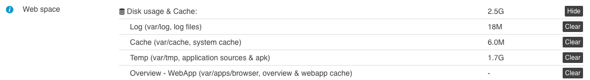

# Core inheritance & customization

[Edit this on Github](https://github.com/Xtraball/SiberianCMS-Doc/edit/master/docs/module/core-inheritance.md)

In SiberianCMS we have designed an inheritance system to allow for custom modification & improvements.

## How it works ?

In the SAE Edition, you'll find two modules subtree in app, `sae` & `local` the local folder override sae, any file named the same as in sae will take precedency on it.

## Cache

The core inheritance is cached, so each time you add or remove a file in local, you must delete the file `var/cache/design.cache`

**Note: when installing and/or updating a module with the regular zip package, the cache is automatically cleared for the users.**

---

However you can also wipe various cache levels manually in the Backoffice dashboard:



## Example

### Design files

**If your module needs to override an actual Siberian design you must explicitely declare it in `bootstrap.php`**

```php
<?php
Siberian_Cache_Design::overrideCoreDesign("ModuleName");
```

The recommended way to override a template is to create a minimal module package, this way everything is self-contained and you can easily maintain code.

```raw
ModuleName
├─ resources
│  └─ design/desktop/siberian/template/loyaltycard/application/edit.phtml
└─ package.json
```

if you need to customize a template for example:

```raw
/app/sae/design/desktop/siberian/template/loyaltycard/application/edit.phtml
```

simply duplicate the file in your module:

```raw
ModuleName/resources/design/desktop/siberian/template/loyaltycard/application/edit.phtml
```

Then apply your modification into this module file/files.

&nbsp;

### Siberian core classes

**Overriding core classes is different, as they explicitely need the module to require classes**
*the autoloader will not find them as they will not be PSR compliant.*

Everything is declared in the `bootstrap.php` file this way:

```php
<?php
/** Get the base path to your module */
$base = Core_Model_Directory::getBasePathTo("/app/local/modules/ModuleName/");

/** Require the classes */
require_once "{$base}/controllers/IndexController.php";
```

#### Example

You want to override:

```raw
/app/sae/modules/Admin/Model/Key.php
```

You have to create:

```raw
ModuleName
├─ [...]
├─ Admin/Model/Key.php
└─ [...]
```

Then require it in your `bootstrap.php`

```php
<?php
/** Get the base path to your module */
$base = path("/app/local/modules/ModuleName/");

/** Require the classes */
require_once "{$base}/Admin/Model/Key.php";
```


---

*Note: SiberianCMS regular update will not alter the local folder, so you can track your customizations safely.*