# Siberian Forms

[Edit this on Github](https://github.com/Xtraball/SiberianCMS-Doc/edit/master/docs/module/forms.md)

In Siberian we have implemented our own Forms & Elements to control design and javascript events

Here is listed all these elements, how to use them from the  `View` to the `Controller`

**Form fields must respect the case of the field they represent in the database.**

## Form example

Below is the code for a form using every single elements available, then each one being described

```php
<?php
/**
 * Class Form_Test
 */
class Form_Test extends Siberian_Form_Abstract 
{

    public function init() 
    {
        parent::init();

        $db = Zend_Db_Table::getDefaultAdapter();

        $this
            ->setAction(__path('/form/test'))
            ->setAttrib('id', 'form-test')
            ->addNav('form-test-nav');

        /** Bind as a create form */
        self::addClass('create', $this);

        /** Hidden */
        $this->addSimpleHidden('element_hidden');

        /** Image upload with crop */
        $this->addSimpleImage(
            'element_image', 
            __('Image'), 
            __('Import an image'), 
            [
                'width' => 300, 
                'height' => 300
            ]
        );

        /** Input text */
        $this->addSimpleText('element_text', __('Text'));

        /** Textarea */
        $this->addSimpleTextarea('element_textarea', __('Textarea'));

        $full = $this->addSimpleTextarea('element_textarea_100', __('Textarea 100%'));
        $full->setNewDesignLarge();

        /** Textara with CKEditor */
        $richtext = $this->addSimpleTextarea(
            'element_textarea_richtext', 
            __('Textarea Richtext')
        );
        $richtext->setRichtext();


        $this->addSimpleSelect(
            'element_select', 
            __('Select'), 
            ['Option #1', 'Option #2', 'Option #3', 'Option #4']
        );

        $this->addSimpleMultiSelect(
            'element_multiselect', 
            __('Multi Select'), 
            ['Option #1', 'Option #2', 'Option #3', 'Option #4']
        );

        $this->addSimpleCheckbox('element_checbox', __('Checkbox'));

        $this->addSimpleMultiCheckbox(
            'element_multichecbox', 
            __('Multi Checkbox'), 
            ['Option #1', 'Option #2', 'Option #3', 'Option #4']
        );

        $this->addSimpleRadio(
            'element_radio',
            __('Radio'), 
            ['Option #1', 'Option #2', 'Option #3', 'Option #4']
        );

        $this->addNav('submit-repeat', 'OK', false);

    }
}
```

### Form action

The action to were the form submit its data is defined by `->setAction()`

```php
<?php
$this->setAction(__path('/form/test'))
```
        
### Form default nav

This will add on your form a default navigation, with back arrow & a submit button

```php
<?php
$this->addNav('form-test-nav')
```

#### parameters

```php
<?php
$this->addNav($name, $save_text = 'OK', $display_back_button = true)
```

|Parameter|Type|Description|
|---|---|---|
|$name|`String`|A unique name to identify your nav ControlGroup|
|$save_text|`String`|The text used for the submit button|
|$display_back_button|`Boolean`|Wether to display or not the back button, used to repeat submit on long forms without back button|

### Form binders

Form events like `submit` or `change` are binded with css classes like below:

#### > create

Binds a form to submit data `onSubmit` event, add the css class `create`

```php
<?php
self::addClass('create', $this);
```

This form reloads the feature on success, or appends the form errors to the DOM.

#### > toggle

Binds a form to submit data `onSubmit` event for single toggling forms, add the css class `toggle` see [#toggle-forms](module/forms#toggle-forms)

```php
<?php
self::addClass('toggle', $this);
```

#### > onchange

Binds a form to submit data `onChange` event for every single item in the form, add the css class `onchange` see [#toggle-forms](module/forms#onchange-forms)

```php
<?php
self::addClass('onchange', $this);
```


#### > delete

Binds a form to submit data `onSubmit` event for single row forms, add the css class `delete` see [#toggle-forms](module/forms#delete-row)

```php
<?php
self::addClass('delete', $this);
```

This binder is used for small delete forms, to trigger various events

* Submit the delete form
* Check if the row was deleted, then remove the corresponding row dynamically from the table
* Or reload the page if this was the only row

## Elements

### Top navigation & submit

#### code

```php
<?php
$this->addNav('form-test-nav')
```

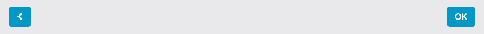

### Image upload with crop

#### code

```php
<?php
/** Image upload with crop */
$this->addSimpleImage(
    'element_image', 
    __('Image'), 
    __('Import an image'), 
    [
        'width' => 300, 
        'height' => 300
    ]
);
```

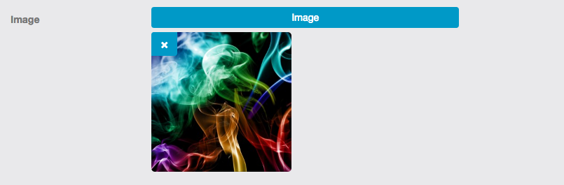

**Crop modal**

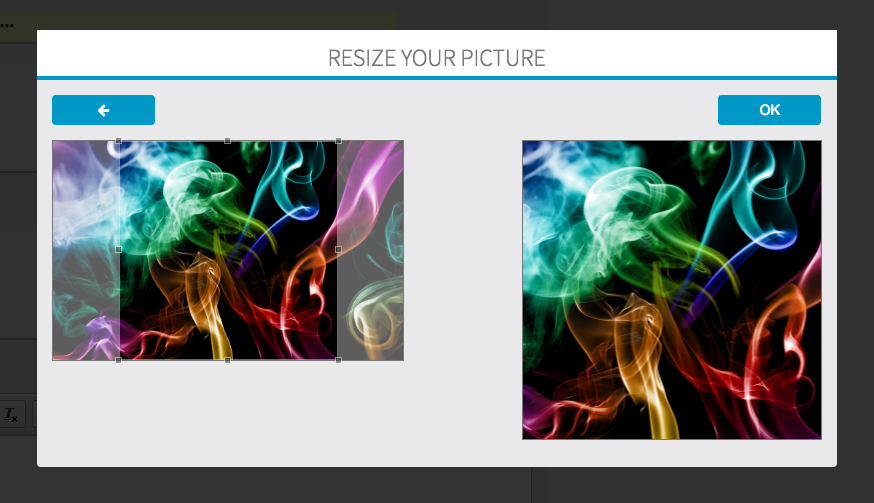

### Input text

#### code

```php
<?php
/** Input text */
$this->addSimpleText('element_text', __('Text'));
```


### Input password

#### code

```php
<?php
/** Input text */
$this->addSimplePassword('element_password', __('Password'));
```


### Textarea

#### code

```php
<?php
/** Textarea */
$this->addSimpleTextarea('element_textarea', __('Textarea'));
```

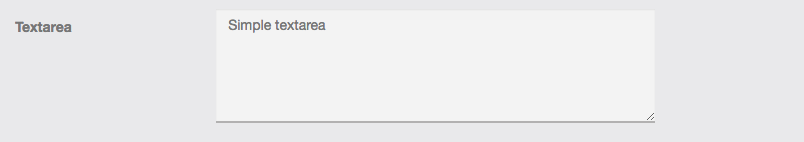

### Textarea 100%

#### code

```php
<?php
$textarea_100 = $this->addSimpleTextarea('element_textarea_100', __('Textarea 100%'));
$textarea_100->setNewDesignLarge();
```

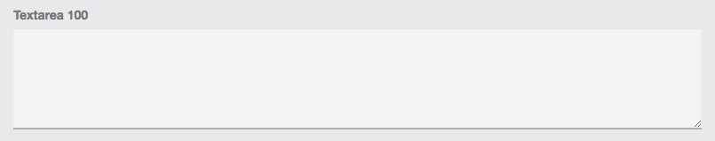

### Richtext (CKEditor)

#### code

```php
<?php
/** Textara with CKEditor */
$richtext = $this->addSimpleTextarea('element_textarea_richtext', __('Textarea Richtext'));
$richtext->setRichtext();
```

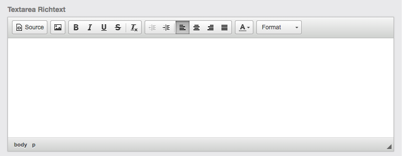

### Select

#### code

```php
<?php
$this->addSimpleSelect(
    'element_select', 
    __('Select'), 
    array('Option #1', 'Option #2', 'Option #3', 'Option #4')
);
```


### MultiSelect

#### code

```php
<?php
$this->addSimpleMultiSelect(
    'element_multiselect', 
    __('Multi Select'), 
    array('Option #1', 'Option #2', 'Option #3', 'Option #4')
);
```


### Checkbox

#### code

```php
<?php
$this->addSimpleCheckbox('element_checbox', __('Checkbox'));
```

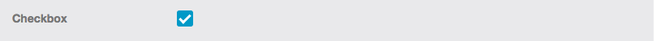

### MultiCheckbox

#### code

```php
<?php
$this->addSimpleMultiCheckbox(
    'element_multichecbox', 
    __('Multi Checkbox'), 
    array('Option #1', 'Option #2', 'Option #3', 'Option #4')
);
```


### Radio button

#### code

```php
<?php
$this->addSimpleRadio(
    'element_radio', 
    __('Radio'), 
    array('Option #1', 'Option #2', 'Option #3', 'Option #4'));
```


### Date, Datetime & Time pickers

#### code

```php
<?php
$this->addSimpleDatetimepicker(
    'date', 
    __('Date Picker'), 
    false, 
    Siberian_Form_Abstract::DATEPICKER
); 
```    

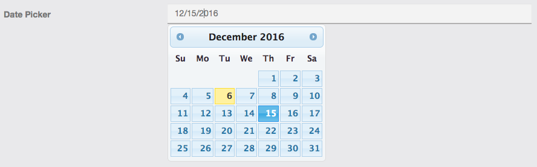

```php
<?php
$this->addSimpleDatetimepicker(
    'datetimepicker', 
    __('DateTime Picker'), 
    false, 
    Siberian_Form_Abstract::DATETIMEPICKER
); 
```    

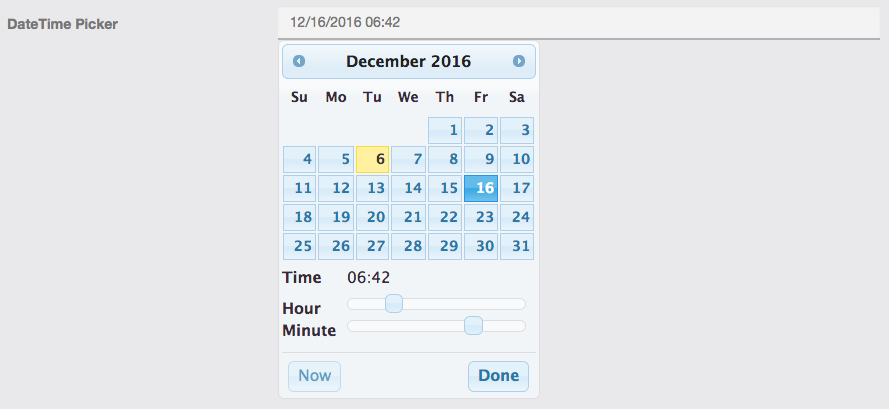

```php
<?php
$this->addSimpleDatetimepicker(
    'timepicker', 
    __('Time Picker'), 
    false, 
    Siberian_Form_Abstract::TIMEPICKER
); 
```    

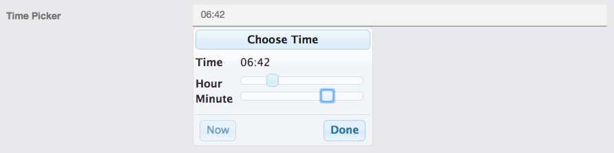

### Slider element

#### code

```php
<?php
$this->addSimpleSlider(
    'element_slidero', 
    __('Slider'), 
    array(
        'min' => -100, 
        'max' => 100, 
        'step' => 5, 
        'unit' => '%'
    ), true);
```

The option `unit` goes along with the last parameter `$with_indicator` to show or not an indicator, `%`, `°`, `px`, etc...

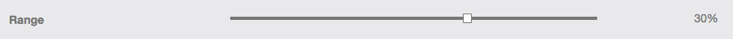

### Submit repeat (for long forms)

#### code

```php
<?php
$this->addNav('submit-repeat', 'OK', false);
```


## Form usage

Creating the form object

```php
<?php
$form_test = new Form_Test();
```

Populating with a Siberian object/model:

```php
<?php
$siberian_object = new Job_Model_Place();

$form_test->populate($siberian_object->getData());
```

`->getData()` will return a raw key => values array representing the object.

&nbsp;

Manually filled with default values:

```php
<?php
$form_test->getElement('element_textarea')->setValue('My textarea default value');
```

`->getElement($name)` will return the form element identified by `$name`, you can then set value, options, attributes, etc...

Displaying the form:

```php
<?php
echo $form_test;
```

## Controller side

### Basic form validation

here the edit action is used for both creating & editing the corresponding object

```php
<?php
public function editAction() {
    /** Retrive the form submit values */
    $values = $this->getRequest()->getPost(); 

    /** Init the form */
    $form = new Job_Form_Place(); 
    
    /** Testing if the form is valid with the given values */
    if($form->isValid($values)) {  
    
        /** Do whatever you need when form is valid */
        $place = new Job_Model_Place(); 
        $place
            ->addData($values)
            ->addData(array(
                "is_active" => true,
            ))
        ;

        /** Moving the uploaded file to the app folder */
        $path_banner = Siberian_Feature::moveUploadedFile(
            $this->getCurrentOptionValue(), 
            Core_Model_Directory::getTmpDirectory()."/".$values['banner'], 
            $values['banner']
        );
        
        /** Replacing the tmp path, with the file path */
        $place->setData("banner", $path_banner);


        /** When an image is not required, this parts handles the deletion */
        if($values["icon"] == "_delete_") {
            $place->setData("icon", "");
        } else if(file_exists(Core_Model_Directory::getBasePathTo("images/application".$values["icon"]))) {
            # Nothing changed, skip
        } else {
            $path_icon = Siberian_Feature::moveUploadedFile(
                $this->getCurrentOptionValue(), 
                Core_Model_Directory::getTmpDirectory()."/".$values["icon"],
                $values["icon"]
            );
            $place->setData("icon", $path_icon);
        }

        /** An example of geocoding an Address */
        if(!empty($values["location"])) {
            $coordinates = Siberian_Google_Geocoding::getLatLng(array(
                "address" => $values["location"]
            ));
            $place->setData("latitude", $coordinates[0]);
            $place->setData("longitude", $coordinates[1]);
        }


        /** Saving the object in */
        $place->save();

        $html = array(
            "success" => 1,
            "message" => __("Success."),
        );
    } else {
        /** Do whatever you need when form is not valid */
        $html = array(
            "error" => 1,
            "message" => $form->getTextErrors(),    /** Required for javascript to handle errors */
            "errors" => $form->getTextErrors(true), /** Required for javascript to handle errors */
        );
    }

    $this->_sendHtml($html);
}
```

### Basic toggling form & action

### Form toggle

```php
<?php
class Job_Form_Place_Toggle extends Siberian_Form_Abstract {

    public function init() {
        parent::init();

        $this
            ->setAction(__path("/job/place/togglepost"))
            ->setAttrib("id", "form-place-toggle")
        ;

        /** Bind as a delete form */
        self::addClass("toggle", $this);

        $db = Zend_Db_Table::getDefaultAdapter();
        $select = $db->select()
            ->from('job_place')
            ->where('job_place.place_id = :value')
        ;

        $place_id = $this->addSimpleHidden("place_id", __("Place"));
        $place_id->addValidator("Db_RecordExists", true, $select);
        $place_id->setMinimalDecorator();

        $this->addMiniSubmit(null, "<i class='fa fa-power-off icon icon-power-off'></i>", "<i class='fa fa-check icon icon-ok'></i>");

        $this->defaultToggle($this->mini_submit, "Enable place", "Disable place");
    }
}
```

Toggle form requires validators, and a "mini submit" like this:

```php
<?php
$this->addMiniSubmit(
    null, 
    "<i class='fa fa-power-off icon icon-power-off'></i>", 
    "<i class='fa fa-check icon icon-ok'></i>"
);
```

And if you need a tooltip message to indicate the action:

```php
<?php
$this->defaultToggle(
    $this->mini_submit, 
    "Enable place", 
    "Disable place"
);
```


---

```php
<?php
public function toggleAction() {
    $values = $this->getRequest()->getPost();

    $form = new Job_Form_Place_Toggle();
    if($form->isValid($values)) {
        $place = new Job_Model_Place();
        
        /** Toggling the field */
        $result = $place->find($values["place_id"])->toggle();

        $html = array(
            "success" => 1,
            /** Return the new state for javascript to toggle the icon */
            "state" => $result,
            /** Return the message corresponding to the new state */
            "message" => ($result) ? __("Place enabled") : __("Place disabled"), 
        );
    } else {
        /** Do whatever you need when form is not valid */
        $html = array(
            "error" => 1,
            "message" => $form->getTextErrors(),
            "errors" => $form->getTextErrors(true),
        );
    }

    $this->_sendHtml($html);
}
```

### Basic delete form & action

### Form delete

```php
<?php
class Job_Form_Place_Delete extends Siberian_Form_Abstract {

    public function init() {
        parent::init();

        $this
            ->setAction(__path("/job/place/deletepost"))
            ->setAttrib("id", "form-place-delete")
            ->setConfirmText("You are about to remove this Place !\n Are you sure ?");
        ;

        /** Bind as a delete form */
        self::addClass("delete", $this);

        $db = Zend_Db_Table::getDefaultAdapter();
        $select = $db->select()
            ->from('job_place')
            ->where('job_place.place_id = :value')
        ;

        $place_id = $this->addSimpleHidden("place_id", __("Place"));
        $place_id->addValidator("Db_RecordExists", true, $select);
        $place_id->setMinimalDecorator();

        $mini_submit = $this->addMiniSubmit();
    }
}
```

### Delete action

```php
<?php
public function deleteAction() {
    $values = $this->getRequest()->getPost();

    $form = new Job_Form_Place_Delete();
    if($form->isValid($values)) {
        $place = new Job_Model_Company();
        $place->find($values["place_id"]);
        
        /** Delete the object */
        $place->delete();

        $html = array(
            'success' => 1,
            'success_message' => __('Place successfully deleted.'),
        );
    } else {
        $html = array(
            "error" => 1,
            "message" => $form->getTextErrors(),
            "errors" => $form->getTextErrors(true),
        );
    }

    $this->_sendHtml($html);
}
```