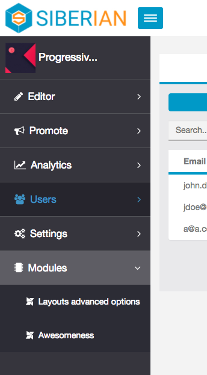
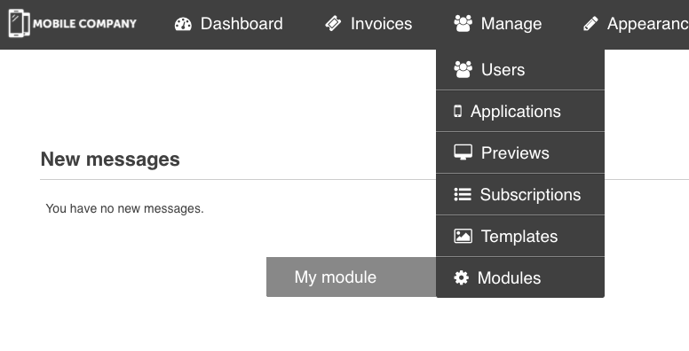

# Editor & Backoffice

[Edit this on Github](https://github.com/Xtraball/SiberianCMS-Doc/edit/master/docs/module/hooks/menus.md)

From Siberian 4.11.1 we added a hook to the Sidebar Left menu & Backoffice header menu (more will come in next updates)

**Icons are available from Siberian 4.12.10 only**

## Editor side menu

For utility reasons, and convenience, when creating your module you need a way to access its configuration page somewhere.

```php
<?php

use Siberian\Module;

Module::addEditorMenu($module, $code, $title, $link, $icon = '', $aclCode = null);
```

The previous code will result in something like this.



#### Options

|Field|Required&nbsp;?|Description|
|-----|---------------|-----------|
|$module|yes|Module name|
|$code|yes|Unique code to identify the link, used for highlights|
|$title|yes|Your link text|
|$link|yes|Path to your feature `/mymodule/mycontroller/myaction`|
|$icon|no|Custom css class to display icon using fontawesome or icofont|
|$aclCode|no|**from 4.15.7** ACL code to access this menu, if null or the code doesn't exists, menu item will be accessible|


#### Examples

**FontAwesome 4.7.0**

```php
<?php

use Siberian\Module;

Module::addEditorMenu('Faq', 'faq', 'FAQ', '/faq/application/list', 'fa fa-line-chart');
```

**IcoFont**

```php
<?php

use Siberian\Module;

Module::addEditorMenu('Faq', 'faq', 'FAQ', '/faq/application/list', 'icofont icofont-bird-wings');
```


&nbsp;


## Backoffice side menu

Backoffice hook works almost the same as Editor hooks.

```php
<?php

use Siberian\Module;

Module::addMenu($module, $code, $title, $link, $icon = '');
```

The previous code will result in something like this.



#### Options

|Field|Required&nbsp;?|Description|
|-----|---------------|-----------|
|$module|yes|Module name|
|$code|yes|Unique code to identify the link, used for highlights|
|$title|yes|Your link text|
|$link|yes|Path to your feature `/mymodule/mycontroller/myaction`|
|$icon|no|Custom css class to display icon using fontawesome or icofont|

#### Examples

**FontAwesome 4.2.0**

```php
<?php

use Siberian\Module;

Module::addMenu('Faq', 'faq', 'FAQ', '/faq/backoffice/list', 'fa fa-ticket');
```

**IcoFont**

```php
<?php

use Siberian\Module;

Module::addMenu('Faq', 'faq', 'FAQ', '/faq/backoffice/list', 'icofont icofont-bird-wings');
```


&nbsp;

## Backoffice - Advanced

**Available from 4.14.6**

#### backoffice.menu.ready

When the backoffice menu hierarchy is built, this action is triggered, you can then alter the tree as you want.

This method is more complex than simply adding your menu, but it's way more powerful too.

You callback function **must** return the given payload whether it's altered or not!

```php
<?php

use Siberian\Hook;

Hook::listen(
    'backoffice.menu.ready',
    'Listening Backoffice menu',
    function ($payload) {
        // Your stuff!
        
        return $payload;
    },
    0
);
```

**Hook payload details**

```php
<?php
// Extract of the tree payload!
$backofficeTree = [
    'dashboard' => [
        'hasChilds' => false,
        'isVisible' => true,
        'label' => __('Dashboard'),
        'url' => $this->getUrl('backoffice'),
        'icon' => 'fa fa-tachometer',
    ],
    'invoices' => [
        'hasChilds' => false,
        'isVisible' => $this->isPe(),
        'label' => __('Invoices'),
        'url' => $this->getUrl("sales/backoffice_invoice_list"),
        'icon' => 'fa fa-ticket',
    ],
    'manage' => [
        'hasChilds' => true,
        'isVisible' => true,
        'label' => __('Manage'),
        'icon' => 'fa fa-users',
        'childs' => [
            'users' => [
                'hasChilds' => true,
                'isVisible' => true,
                'label' => __('Users'),
                'icon' => 'fa fa-users',
                'childs' => [
                    'users' => [
                        'hasChilds' => false,
                        'isVisible' => true,
                        'label' => __('Users'),
                        'url' => $this->getUrl("admin/backoffice_list"),
                        'icon' => 'fa fa-users',
                    ],
                ],
            ],        
    [...],
];
```

#### Payload details

key|details
---|---
hasChilds|tells if the node is a parent or not
isVisible|true, false or a condition to display the menu
label|the translated title `__('Text to translate')`
icon|same a previous with either `FontAwesome` or `IcoFont`
url|the url to access the feature/module
childs|if `hasChilds` is `true` then you must provide a childs array

---

**Available from 4.15.0**

#### editor.header.menu.ready

When the editor menu hierarchy is built, this action is triggered, you can then alter the tree as you want.

This method is more complex than simply adding your menu, but it's way more powerful too.

You callback function **must** return the given payload whether it's altered or not!

```php
<?php

use Siberian\Hook;

Hook::listen(
    'editor.header.menu.ready',
    'Listening Editor header menu',
    function ($payload) {
        // Your stuff!
        
        return $payload;
    },
    0
);
```

**Hook payload details**

```php
<?php
// Extract of the tree payload!
$editorTree = [
    'dashboard' => [
        'hasChilds' => false,
        'isVisible' => true,
        'label' => __('Dashboard'),
        'id' => 'sb-tour-dashboard',
        'is_current' => 'app_list' === $current,
        'url' => $this->getUrl('/'),
        'icon' => 'fa fa-tachometer',
    ],
    [...],
    'profile' => [
        'hasChilds' => true,
        'isVisible' => true,
        'label' => __('Profile'),
        'id' => 'sb-tour-profile',
        'icon' => 'fa fa-user',
        'childs' => [
            'my_account' => [
                'hasChilds' => false,
                'isVisible' => true,
                'label' => __('Account Settings'),
                'url' => $this->getUrl('admin/account/edit'),
                'is_current' => 'my_account' === $current,
            ],
            'access_management' => [
                'hasChilds' => false,
                'isVisible' => !$request->isWhiteLabelEditor() && $this->_canAccess('admin_access_management'),
                'label' => __('Access Management'),
                'url' => $this->getUrl('admin/access_management/list'),
                'is_current' => 'access_management' === $current,
            ],
            [...]
            'profile_divider' => [
                'isVisible' => true,
                'divider' => true,
                'is_current' => false,
            ],
            'logout' => [
                'hasChilds' => false,
                'isVisible' => true,
                'label' => __('Log-out'),
                'url' => $this->getUrl('admin/account/logout'),
                'is_current' => false,
            ],
        ],
    ],
    [...]
];
```

#### Payload details

key|details
---|---
hasChilds|tells if the node is a parent or not
isVisible|true, false or a condition to display the menu
label|the translated title `__('Text to translate')`
icon|same a previous with either `FontAwesome` or `IcoFont`
is_current|highlight or not the current active menu
divider|special item divider, not a menu
id|the node id
url|the url to access the feature/module
childs|if `hasChilds` is `true` then you must provide a childs array

---

---

**Available from 4.15.7**

#### editor.left.menu.ready

When the sidebar left menu hierarchy is built, this action is triggered, you can then alter the tree as you want.

This method is more complex than simply adding your menu, but it's way more powerful too.

You callback function **must** return the given payload whether it's altered or not!

```php
<?php

use Siberian\Hook;

Hook::listen(
    'editor.left.menu.ready',
    'Listening Editor sidebar left menu',
    function ($payload) {
        // Your stuff!
        
        return $payload;
    },
    0
);

// Working example

Hook::listen(
    "editor.left.menu.ready",
    "Listening editor ok",
    function ($payload) {
        // Internal function, the callback must be a PURE function!
        
        // This is a short alias to check ACL from anywhere.
        $canAccess = function($acl) {
            $aclList = \Admin_Controller_Default::_getAcl();
            if ($aclList) {
                return $aclList->isAllowed($acl);
            }

            return true;
        };

        // Fetch the current path
        $currentUrl = str_replace(\Core\Model\Base::getBaseUrl(), "", \Core\Model\Base::getCurrentUrl());

        $payload["analytics"]["childs"]["customanalytics"] = [
            "hasChilds" => false,
            "isVisible" => $canAccess("customer_analytics_acl"), // Ensure your are either FULL ADMIN, or have the Correct ACL!!!
            "label" => __("My custom analytics page"),
            "icon" => "fa fa-bar-chart",
            "url" => __path("/customanalytics/application/view"), // Generates a simple path to the feature
            "is_current" => (preg_match("#^/migastats/application/view#", $currentUrl)), // Check against what path should be to highlight or not
        ];

        return $payload;
    },
    0
);
```

**Hook payload details**

```php
<?php
// Extract of the tree payload!
$editorSidebarLeftTree = [
    'editor' => [
        'hasChilds' => true,
        'isVisible' => $this->_canAccessAnyOf($editorAccess),
        'label' => __('Editor'),
        'id' => 'sidebar-left-group-editor',
        'is_current' => false,
        'url' => $this->getUrl('/'),
        'icon' => 'fa fa-pencil',
        'childs' => [
            'design' => [
                'hasChilds' => false,
                'isVisible' => $this->_canAccess("editor_design"),
                'label' => __('Design'),
                'icon' => 'icon ion-sb-layout1',
                'url' => $this->getUrl('application/customization_design_style/edit'),
                'is_current' => ('editor_design' === $currentLink),
            ],
            'colors' => [
                'hasChilds' => false,
                'isVisible' => $this->_canAccess("editor_colors"),
                'label' => __('Colors'),
                'icon' => 'icon ion-sb-palette',
                'url' => $this->getUrl('application/customization_design_colors/edit'),
                'is_current' => ('editor_colors' === $currentLink),
            ],
            [...]
        ],
    ],
    'users' => [
        'hasChilds' => false,
        'isVisible' => $this->_canAccess("users"),
        'label' => __('Users'),
        'id' => 'sidebar-left-users',
        'is_current' => false,
        'url' => $this->getUrl('customer/application/list'),
        'icon' => 'icon ion-sb-group',
    ],
    [...]
    'settings' => [
        'hasChilds' => true,
        'isVisible' => $this->_canAccessAnyOf(['editor_settings_tc', 'editor_settings_apis', 'editor_settings_domain', 'editor_settings_advanced', 'editor_settings_messages']),
        'label' => __('Settings'),
        'id' => 'sidebar-left-group-settings',
        'is_current' => false,
        'url' => $this->getUrl('/'),
        'icon' => 'icon ion-sb-cogs',
        'childs' => [
            'editor_settings_tc' => [
                'hasChilds' => false,
                'isVisible' => $this->_canAccess("editor_settings_tc"),
                'label' => __('Terms & Conditions'),
                'icon' => 'fa fa-file-text',
                'url' => $this->getUrl('application/settings_tc'),
                'is_current' => ('editor_settings_tc' === $currentLink),
            ],
            [...]
        ],
    ],
];
```

#### Payload details

key|details
---|---
hasChilds|tells if the node is a parent or not
isVisible|true, false or a condition to display the menu
label|the translated title `__('Text to translate')`
icon|same a previous with either `FontAwesome` or `IcoFont`
is_current|highlight or not the current active menu
id|the node id
url|the url to access the feature/module
childs|if `hasChilds` is `true` then you must provide a childs array

---