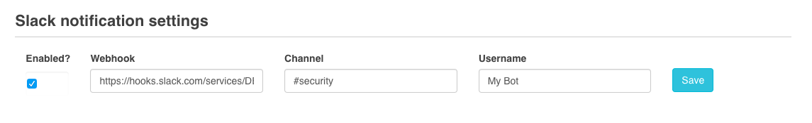

# Security

[Edit this on Github](https://github.com/Xtraball/SiberianCMS-Doc/edit/master/docs/module/security.md)

## Slack notifications

If you want to enable Slack notifications for the WAF.

Edit the file `config.php` add the following line `$_config['fw_slack_is_active'] = 'yes';` then save!

When done you will be see a new section in *Backoffice > Settings > Advanced > Firewall* 

Simply fill it with your Webhook URL, Channel & Username then save!

Every *Firewall* alert will trigger a notification in your subsequent Slack channel!
