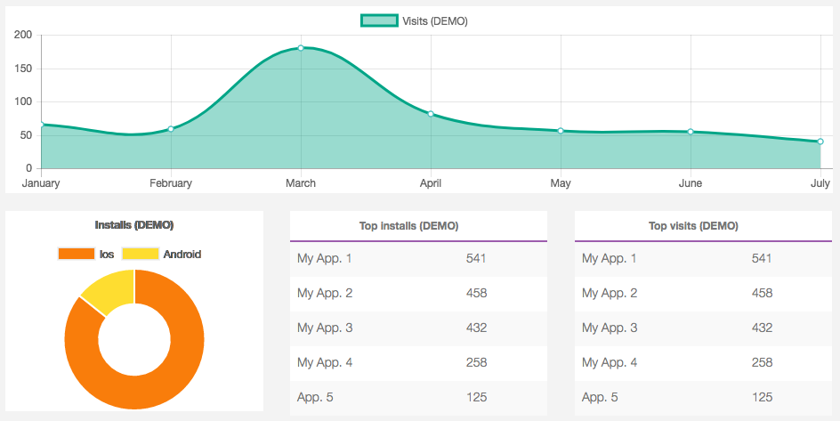
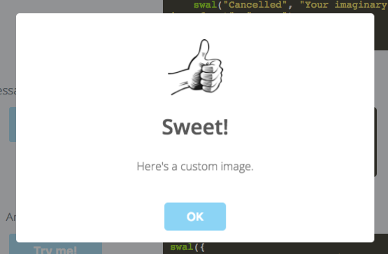

# Frameworks

[Edit this on Github](https://github.com/Xtraball/SiberianCMS-Doc/edit/master/docs/stack/frameworks.md)

Below you'll find a complete list of the various frameworks we use both in Editor, Backoffice & Applications.

Most of our Cordova & Ionic libraries are customized for Siberian.

## Editor

The main codebase inside the editor is powered with `jQuery` and `bootstrap`.

### FontAwesome 

- Version: `4.7.0`

- [See on Github](https://github.com/FortAwesome/Font-Awesome)

### Bootstrap 

- Version: `3.2.0`

- [See on Github](https://github.com/twbs/bootstrap)

### CKEditor

- Version: `4`

- CKEditor our richtext editor, used all across the Editor for every feature.

- [See on Github](https://github.com/ckeditor)

### CodeMirror

- Version: `latest`

- CodeMirror is used to highlight Code, Scripts & more, we use it for our inline `SCSS` editor & also as a plugin for our CKEditor source feature. 

- [See on Github](https://github.com/codemirror/CodeMirror)

### Chart.js

- Chart.js is powering our App analytics like below.

- [See on Github](https://github.com/chartjs/Chart.js) 



### DataTables

- [See on Github](https://github.com/DataTables/DataTables)

### nestedSortable

- [See on Github](https://github.com/ilikenwf/nestedSortable)

### prettyPhoto

- [See on Github](https://github.com/scaron/prettyphoto)

### jQuery UI

- [See on Github](https://github.com/jquery/jquery-ui)

### SweetAlert

- Version: `latest`

- [See on Github](https://github.com/t4t5/sweetalert)



*Basic example*

```js
swal("Here's a message!");
```

You can see [this page](http://t4t5.github.io/sweetalert/) for more advanced usage.


## Backoffice

In the backoffice we are mainly using AngularJS along with some plugins for UI, CKEditor, Graphs.

### FontAwesome 

- Version: `4.2.0`

- [See on Github](https://github.com/FortAwesome/Font-Awesome)


### Bootstrap 

- Version: `3.2.0`

- [See on Github](https://github.com/twbs/bootstrap)


### AngularJS

- Version: `1.3.0`

- [See on Github](https://github.com/angular/angular)


### CKEditor

- Version: `3`

- [See on Github](https://github.com/ckeditor)


## Backend

All our backend is running under Zend Framework with a complete custom stack on top of it, we also use libraries for Push & SCSS.

### PHP

- Version: from `7.0` up to `7.2` 

- [See on Github](https://github.com/php)

### Zend Framework

- Based on ZF1, customized for Siberian & topped with Siberian library

- [See on Github](https://github.com/zendframework/zf1)


## Applications

### Based on Ionic / AngularJS

#### Highly customized with

- Lazy & Modular loading
- Dynamic caching
- Extended SCSS

&nbsp;

### Cordova

#### All our cordova platforms are forked and customized.

#### Android

- [See on Github](https://github.com/Xtraball/cordova-android)

#### iOS

- [See on Github](https://github.com/Xtraball/cordova-ios)

#### Browser

- [See on Github](https://github.com/Xtraball/cordova-browser)

&nbsp;

### Cordova Plugins

#### All our cordova plugins are forked and customized.

#### Insomnia

- Prevents sleep for continuous app usage like GPS navigation.

- [See on Github](https://github.com/Xtraball/cordova-plugin-insomnia)

&nbsp;

#### MusicControls

- Display music controls in Notification center.

- [See on Github](https://github.com/Xtraball/cordova-music-controls-plugin)

&nbsp;

#### AdMob Pro

- Google AdMob ads Banner & Interstitial.

- [See on Github](https://github.com/Xtraball/cordova-admob-pro)

&nbsp;

#### AppEvent

- [See on Github](https://github.com/Xtraball/cordova-plugin-app-event)

&nbsp;

#### App Version

- [See on Github](https://github.com/Xtraball/cordova-plugin-app-version)

&nbsp;

#### BarcodeScanner

- QRCode scanner.

- [See on Github](https://github.com/Xtraball/phonegap-plugin-barcodescanner)

&nbsp;

#### Camera

- Camera & Library manager.

- [See on Github](https://github.com/Xtraball/cordova-plugin-camera)

&nbsp;

#### Hot Code Push

- Manages assets codebase live updates.

- [See on Github](https://github.com/Xtraball/cordova-hot-code-push)

&nbsp;

#### Device 

- [See on Github](https://github.com/Xtraball/cordova-plugin-device)

&nbsp;

#### File

- [See on Github](https://github.com/Xtraball/cordova-plugin-file)

&nbsp;

#### Geolocation

- [See on Github](https://github.com/Xtraball/cordova-plugin-geolocation)

&nbsp;

#### InAppBrowser

- [See on Github](https://github.com/Xtraball/cordova-plugin-inappbrowser)

&nbsp;

#### Local Notification

- [See on Github](https://github.com/Xtraball/cordova-plugin-local-notifications)

&nbsp;

#### Media

- [See on Github](https://github.com/Xtraball/cordova-plugin-media)

&nbsp;

#### Navigator

- [See on Github](https://github.com/Xtraball/cordova-navigator)

&nbsp;

#### Permissions

- [See on Github](https://github.com/Xtraball/Permissions)

&nbsp;

#### SecondWebview

- [See on Github](https://github.com/Xtraball/cordova-second-webview)

&nbsp;

#### SocialSharing

- [See on Github](https://github.com/Xtraball/cordova-plugin-socialsharing)

&nbsp;

#### SplashScreen

- [See on Github](https://github.com/Xtraball/cordova-plugin-splashscreen)

&nbsp;

#### StatusBar

- [See on Github](https://github.com/Xtraball/cordova-plugin-statusbar)

&nbsp;

#### Push

- [See on Github](https://github.com/Xtraball/siberian-plugin-push)

&nbsp;

### Javascript

#### Swiper

- Version: `3.4.1`

- [See on Github](https://github.com/nolimits4web/Swiper)

&nbsp;

#### Lodash

- Version: `1.8.3`

- [See on Github](https://github.com/lodash/lodash)

&nbsp;

#### LocalForage

- Version: `1.4.3`

- [See on Github](https://github.com/localForage/localForage)

&nbsp;

#### Siberian NqQueue

- [See on Github](https://github.com/Xtraball/angular-queue)

&nbsp;

#### Moment.js

- Version: `2.18.1`

- [See on Github](https://github.com/moment/moment)

&nbsp;

#### ProgressBar

- Version: `1.0.1`

- [See on Github](https://github.com/kimmobrunfeldt/progressbar.js)

&nbsp;

